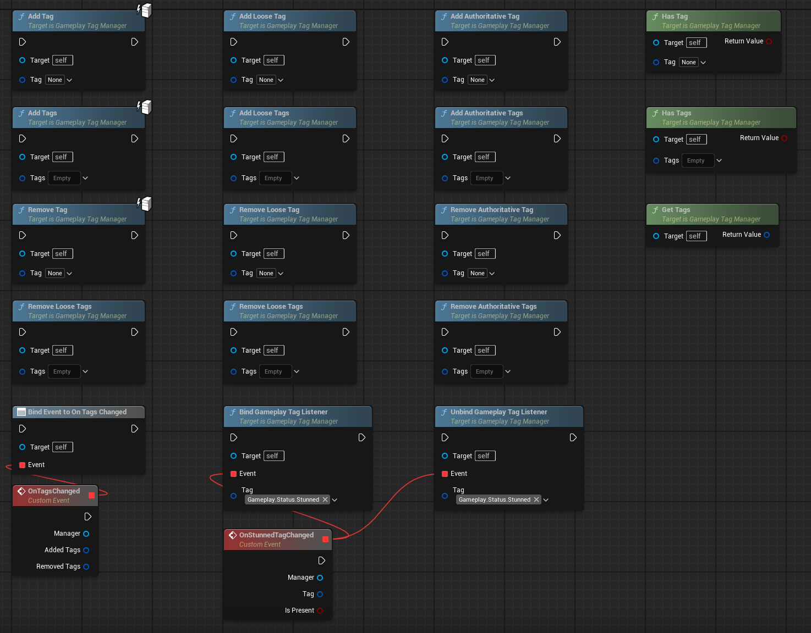

# Gameplay Tag Manager

This plugin adds a small component which can store gameplay tags just like Ability System Component. It's made for 
people that don't use Gameplay Ability System for their projects, and want that functionality.

## Installation

Clone the repository in your project's Plugin directory.

## Functionality

- Normal tags are replicated to everyone.

- Loose tags are not replicated at all.

- Authoritative tags are replicated to everyone but owner. Owner (locally controlling client) is changing that on its 
own, as if they are loose tags.

## Dependencies

- [dbgLog](https://github.com/Tonetfal/dbgLOG)