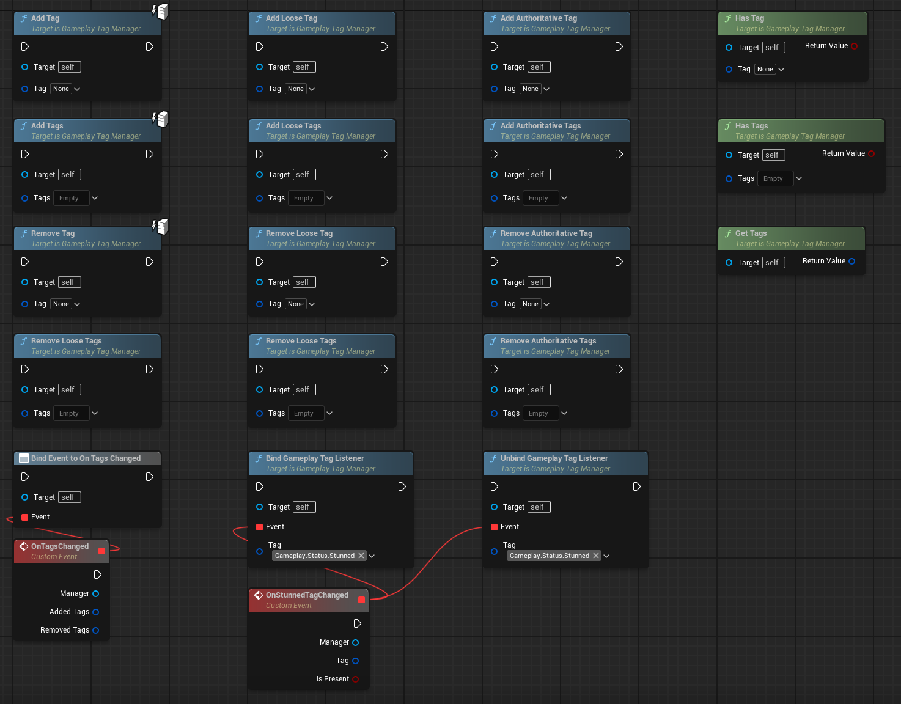

# Gameplay Tag Manager

General purpose component that can be used to keep track of tags on a component. 

It's similar to Ability System Component, but it's a standalone component offering similar functionality useful for project that aren't relying on GAS.

## Installation

Clone the repository in your project's Plugin directory.

## Functionality

The plugin offers one single component - Gameplay Tag Manager.

It presents Replicated, Loose and Authoritative tags you can add/remove.
- Replicated tags: can be only changed server-side, and will be automatically replicated to everyone.
- Loose tags: can be changed by anyone, and will never replicate.
- Authoritative tags: can be only changed by server or autonomous proxy, and will be only replicated to simulated proxies. Useful for prediction.

All tags are uniformly advertised as "Tags". You can query or listen for tags changes no matter their nature.

All tag types support counting. Negative values are invalid. Count 0 will immediately remove the tag.

Regardless the amount of a given tag in any type, "Tags" and delegates will only fire when that tag makes its first appearance or gets removed entirely from every single type.

## Dependencies

- [dbgLog](https://github.com/Tonetfal/dbgLOG)
